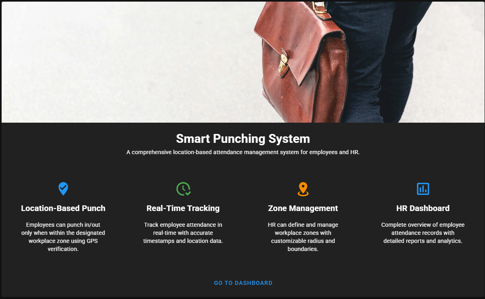
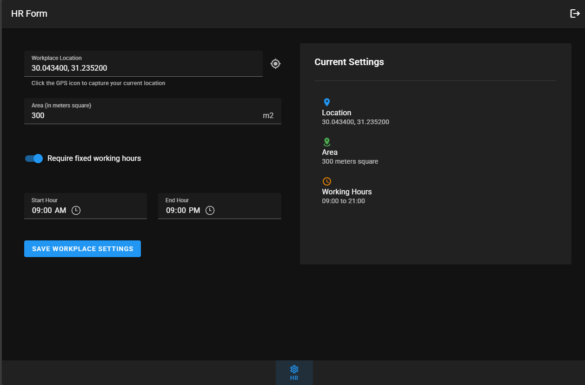
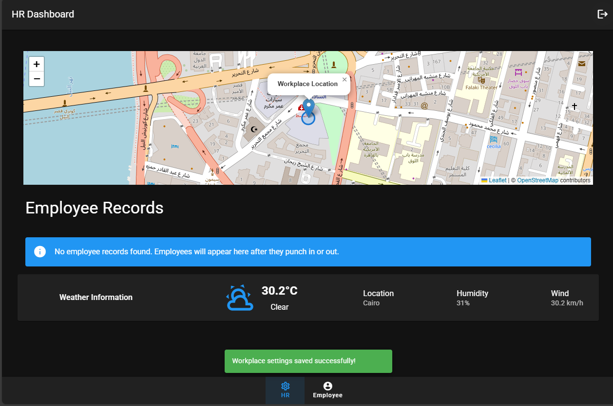
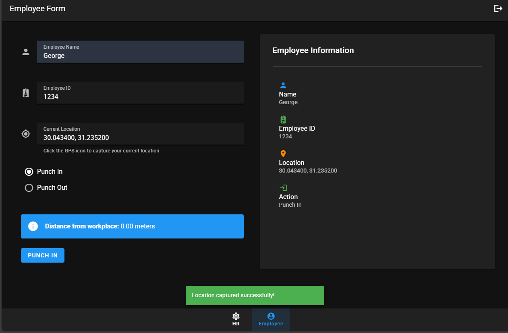
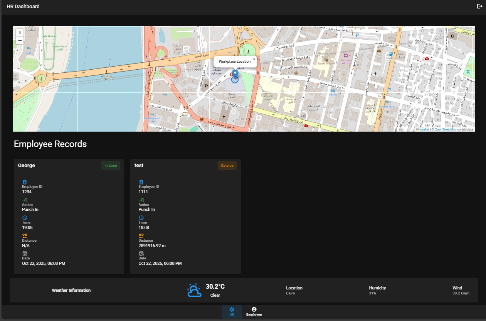

# Smart Punching System

A location-based attendance management system built with Vue 3, Vuetify, Vuex, and Leaflet.
It enables employees to punch in/out only when they are inside a designated workplace zone, while HR ---

## Overview

The Smart Punching System provides a seamless and intelligent way for organizations to manage attendance It ensures accurate attendance logs, prevents false punching, and simplifies HR operations ---

## Screen Shots







## Core Features

- Location-Based Punch — Employees can punch in/out only within the assigned workplace zone verified - Real-Time Tracking — Tracks employee attendance in real-time with accurate timestamps and live location - Zone Management — HR can define, and manage geofenced zones with a customizable radius.
- HR Dashboard — Comprehensive dashboard showing attendance records .
- Map Integration (Leaflet) — Interactive map for visualizing zones and employee locations.
- Responsive UI — Built with Vuetify 3 for mobile-friendly design.
- Vuex State Management — Centralized data control for employees, HR, and zones.

---

## Tech Stack

| Category           | Technology                           |
| ------------------ | ------------------------------------ |
| Frontend Framework | Vue 3                                |
| UI Framework       | Vuetify 3                            |
| State Management   | Vuex                                 |
| Maps & Geolocation | Leaflet.js + Browser Geolocation API |
| Routing            | Vue Router                           |
| Icons              | Material Design Icons (mdi)          |
| Build Tool         | Vite                                 |

---

## Project Setup

### Step 1: Install dependencies

```bash
npm install
```

### Step 2: Run the development server

```bash
npm run dev
```

### Step 3: Build for production

```bash
npm run build
```

### Step 4: Preview production build

```bash
npm run preview
```

## Environment Variables

Create a `.env` file at the root if using map APIs or back-end integration:
VITE_MAP_API_KEY=your_map_api_key_here
VITE_WEATHER_API_URL=http://api.weatherapi.com/v1

---

## User Roles

### Employee

- Punch in/out using GPS location
- View attendance records

### HR/Admin

- Manage employees
- Define zones (radius-based)
- Monitor attendance

---

## Future Enhancements

- Role-based authentication (JWT)
- Attendance reports export (CSV/PDF)
- Google Maps API integration
- Monthly summaries
- PWA (Progressive Web App)
- Offline punch caching

---

## Author

Developed by: George Geham
Computer & Software Engineering student at Ain Shams University
Front-end Developer | Vue.js | Vuetify | State Management Enthusiast
